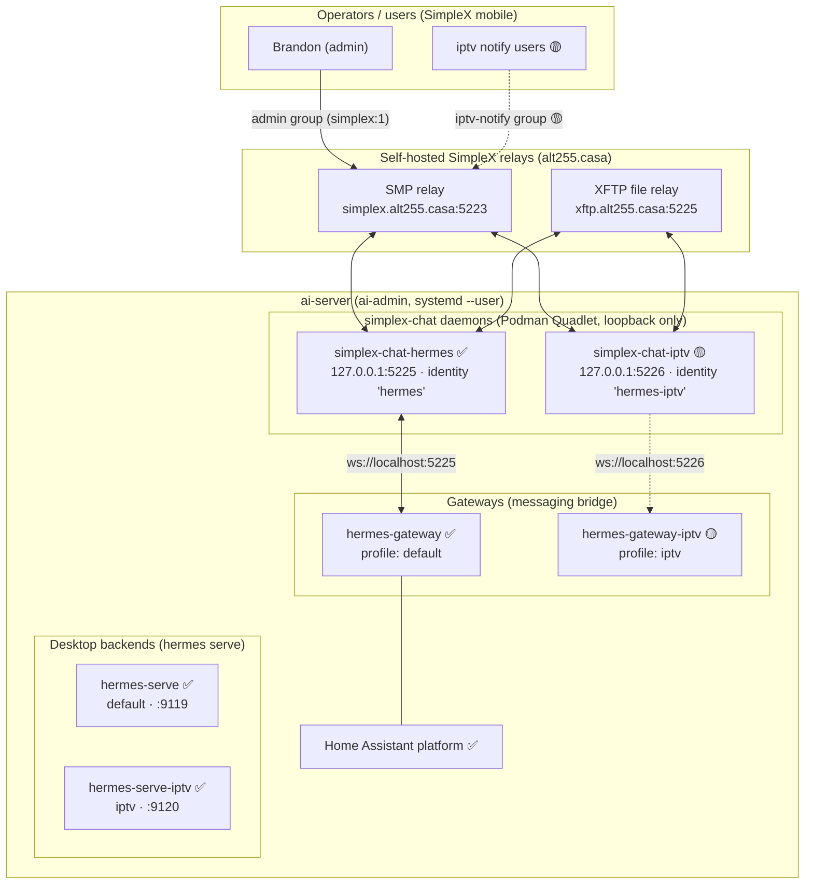
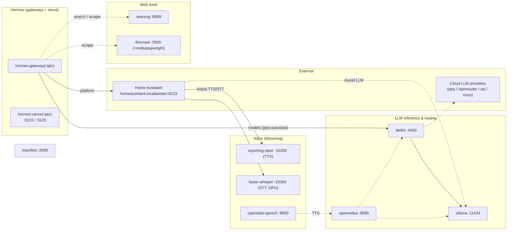

# ai-server — architecture reference

> Living document. Snapshot of what runs on the Hermes **ai-server** so future work
> starts with context instead of re-discovery. Update it whenever the topology changes.
>
> **Last verified:** 2026-07-16 (live inspection over SSH).
> **Legend:** ✅ live &nbsp;·&nbsp; 🟡 planned/in-progress (see
> `plans/2026-07-16-iptv-simplex-profile-plan.md`).

## Host

| Item | Value |
|---|---|
| SSH alias | `hermes-ai` → `ai-server.localdomain` (see `~/.ssh/config`) |
| OS | Fedora (kernel 6.17.x), `x86_64` |
| Service user | `ai-admin` (home `/var/home/ai-admin`, `%h`; `/home` symlinks to `/var/home`) |
| Hermes install | `~/.hermes/hermes-agent` (Python `.venv`), `HERMES_HOME=~/.hermes` |
| Orchestration | systemd **user** units (`systemctl --user …`) + Podman **Quadlet** |

## Deployment & code integrity ⚠️

- **Code lives at** `~/.hermes/hermes-agent`, **editable uv install** (`.venv`). The
  running Python processes import from disk at start — a `git checkout` does **not**
  affect a running process until it is restarted.
- **Deploy branch:** `feat/simplex-0.16` (the fork). Both it and local `main` now track
  **`fork/*`** (`fork` = `brandon-btcgroup`). Reinstall after a code change with:
  `cd ~/.hermes/hermes-agent && uv sync --extra simplex --extra homeassistant`, then
  restart the affected services.
- **Required extras:** `simplex` (websockets) + `homeassistant` (`aiohttp`). A plain
  `uv sync` (no extras) **drops `aiohttp` and breaks Home Assistant.** telegram/slack/etc.
  lazy-install on first use and are not needed here.
- **Footgun (fixed 2026-07-16):** local `main` used to track **upstream** (`origin` =
  NousResearch). On 2026-07-12 a `checkout main; pull --ff-only origin main` silently
  reverted the box to upstream's SimpleX plugin; it ran upstream — not the fork — until
  2026-07-16. `main` has been repointed to `fork/main` so this can't recur. Verify the
  live code is the fork: the SimpleX adapter should show many
  `TEXT_BATCH_DELAY|replay|groupMember` markers (fork ≈ dozens; upstream ≈ 3), and
  `hermes simplex --help` must list `{list,join}`.

## System overview



**Read it as:** operators talk to the bots over SimpleX; the self-hosted SMP/XFTP relays
carry the encrypted traffic; each `simplex-chat` daemon is one SimpleX identity, exposed
on loopback only; a per-profile **gateway** consumes a daemon and bridges messages to the
Hermes agent for that profile. `hermes serve` backends are the Desktop-app API, separate
from messaging.

## systemd `--user` services

| Unit | Status | Role | Key detail |
|---|---|---|---|
| `simplex-chat-hermes.service` | ✅ | SimpleX daemon, default identity | Quadlet; `127.0.0.1:5225`; volume `simplex-chat-hermes-data` |
| `hermes-gateway.service` | ✅ | Messaging gateway, **default** profile | `hermes_cli.main gateway run`; `Restart=always` |
| `hermes-serve.service` | ✅ | Desktop backend, default | `serve --host 0.0.0.0 --port 9119` |
| `hermes-serve-iptv.service` | ✅ | Desktop backend, iptv | `--profile=iptv serve … --port 9120` |
| `simplex-chat-iptv.service` | 🟡 | SimpleX daemon, iptv identity | Quadlet; `127.0.0.1:5226`; volume `simplex-chat-iptv-data` |
| `hermes-gateway-iptv.service` | 🟡 | Messaging gateway, **iptv** profile | `--profile=iptv gateway run` |

> Gateways are **not** multiplexed — one gateway per profile, deliberately, for isolation.

## Ports (all loopback / localhost)

| Port | Owner | Notes |
|---|---|---|
| 5225 | `simplex-chat-hermes` daemon | container 5225; WS protocol has **no auth** → loopback only |
| 5226 | `simplex-chat-iptv` daemon 🟡 | container 5225 → host 5226 |
| 9119 | `hermes-serve` (default) | Desktop backend API |
| 9120 | `hermes-serve-iptv` | Desktop backend API |

## SimpleX topology

- **Relays (self-hosted, `alt255.casa`):** SMP `smp://…@simplex.alt255.casa:5223`,
  XFTP `xftp://…@xftp.alt255.casa:5225`. Full URLs (with credentials) live in
  `~/.config/containers/systemd/simplex-chat-<name>.env` — **not** in this doc.
- **Identity = data volume.** Each daemon's SimpleX identity/keys/DB live in its named
  Podman volume (`simplex-chat-hermes-data`, `simplex-chat-iptv-data`). A new volume =
  a new identity/QR.
- **Daemon image:** `localhost/simplex-chat-hermes:latest` (built from the repo's
  `Dockerfile.simplex`). The iptv daemon reuses this same image with a different volume.
- **File transfer:** inbound/outbound media bind-mounted at
  `~/.hermes/cache/simplex-files` (default) / `~/.hermes/cache/simplex-iptv-files` (iptv),
  auto-accept up to 50 MB.
- **Channels (SimpleX groups):**
  - default profile home channel = `simplex:1` (group **"hermes-agent"**) — startup /
    cron / notification target.
  - iptv admin channel ✅ = group **`1`** (name `iptv-admin`) on the iptv daemon; you
    direct the iptv agent here (two-way verified).
  - iptv notify channel 🟡 = a second group for a subset of users (receive + limited
    replies); design pending — see Phase 2 brief.

## Profiles

Each profile is a self-contained `HERMES_HOME`:

| Profile | HERMES_HOME | SimpleX identity | Gateway |
|---|---|---|---|
| `default` | `~/.hermes` | `simplex-chat-hermes` (5225) | `hermes-gateway` ✅ |
| `iptv` | `~/.hermes/profiles/iptv` | `simplex-chat-iptv` (5226) ✅ | `hermes-gateway-iptv` ✅ |

Config precedence for the SimpleX adapter: the profile's **`.env`** is authoritative
(`SIMPLEX_WS_URL`, `SIMPLEX_HOME_CHANNEL[_NAME]`, `SIMPLEX_ALLOWED_USERS`,
`SIMPLEX_ALLOW_ALL_USERS`); `config.yaml`'s `platforms.simplex` only needs
`enabled: true`.

**Model:** both profiles default to `ppq-autoclaw` via the **`litellm`** provider
(`config.yaml` → `model.provider: litellm`, base_url `http://localhost:4000/v1`). Do NOT
set `model.provider: custom` with `ppq-autoclaw` — "custom" routes to OpenRouter (whose
token is expired → HTTP 401). The proxy also exposes `xai/grok-4-1-fast-reasoning` if you
want Grok. iptv has Home Assistant **disabled** (its `HASS_*` creds are commented out).

## Authorization model (important)

- Inbound authz is core (`gateway/authz_mixin.py`): `ALLOW_ALL` → env allowlist →
  pairing store → global → **deny**.
- **Group messages are attributed to the individual member** — the deployed fork adapter
  sets `sender_id` to the sender's **per-membership member id**, NOT `group:<id>`
  (verified live). So to allowlist a person in a group you use their member id, and
  **per-member gating within a group works** (good for the Phase 2 notify channel).
- **Member ids are local & per-daemon.** SimpleX assigns no global user id; each daemon
  mints its own local id for a given person. So the same human has a *different* id on
  each daemon (e.g. Brandon = `TjdJ…` on the default daemon, `MUNH…` on the iptv daemon).
  Each profile's `SIMPLEX_ALLOWED_USERS` needs its own daemon's id — they are not shared.
- **Display-name matching** is also supported (`SIMPLEX_ALLOWED_USERS` accepts the
  display name), but it is **spoofable** — prefer member ids for anything security-facing.
- `SIMPLEX_GROUP_ALLOWED` and `SIMPLEX_AUTO_ACCEPT` are declared in `plugin.yaml` but
  **not consumed** — do not rely on them.
- ✅ **Current posture (2026-07-16):** both profiles run `SIMPLEX_ALLOW_ALL_USERS=false`,
  id-locked. default → `TjdJ…` (member id), iptv → `MUNH…`. The old
  `SIMPLEX_ALLOW_ALL_USERS=true` exposure on default is closed; dead `SIMPLEX_GROUP_IDS`
  removed from both.

## Broader ai-server stack (non-hermes containers)

The box hosts a full self-hosted AI stack in **Podman Quadlet** containers (units in
`~/.config/containers/systemd/*.container`) alongside the hermes/simplex pieces. Inventory
verified 2026-07-16:

| Container | Image | Port(s) | Role |
|---|---|---|---|
| `ollama` | `ollama/ollama` | `11434` | Local LLM inference (serves `qwen3-local`, `gemma4-local`, …) |
| `litellm` | `berriai/litellm` | `4000` | **LLM gateway/proxy** — the hub hermes uses (`ppq-autoclaw`); model list in its own DB (`store_model_in_db`), managed at the :4000 UI |
| `openwebui` | `open-webui` | `8080` | Web chat UI over the local models |
| `wyoming-piper` | `rhasspy/wyoming-piper` | `10200` | **TTS** (Wyoming protocol) |
| `wyoming-faster-whisper` | `linuxserver/faster-whisper:gpu` | `10300` | **STT** (Wyoming, **GPU**) |
| `openedai-speech` | `matatonic/openedai-speech-min` | `8000` | OpenAI-compatible speech/TTS (XTTS) |
| `searxng` | `searxng/searxng` | `8888` | Self-hosted metasearch |
| `firecrawl-redis` | `redis:alpine` | `6379` | Firecrawl queue/cache |
| `firecrawl-playwright` | `firecrawl/playwright-service` | — | Firecrawl headless browser |
| *firecrawl API* | node (`dist/api.js`) | `3000` | Firecrawl scrape API (host node process, not a container) |
| `manifest` | `manifestdotbuild/manifest` | `2099` | "Manifest router" — lightweight backend/API framework |
| `simplex-chat-hermes` | `localhost/simplex-chat-hermes` | `127.0.0.1:5225` | SimpleX daemon (default) — see above |
| `simplex-chat-iptv` | `localhost/simplex-chat-hermes` | `127.0.0.1:5226` | SimpleX daemon (iptv) — see above |

> The Wyoming voice ports (10200/10300) and ollama (11434) bind `0.0.0.0` so an **external
> Home Assistant** (`homeassistant.localdomain:8123`, a *different* host) can reach them for
> its Assist pipeline. SimpleX daemons stay loopback-only.
>
> This machine is also a desktop workstation — `steam`, `kdeconnectd`, `cups` (:631), etc.
> are host noise, not part of the AI stack.

### How it fits together

Solid = verified this session; dashed = typical wiring, not directly confirmed.



**Reading it:** `litellm` is the LLM hub — hermes and openwebui both consume it, and it
fans out to local `ollama` plus cloud providers. The Wyoming voice trio serves the external
Home Assistant's Assist pipeline. `searxng` + `firecrawl` back hermes' web tooling. The
`manifest` router and the desktop apps are independent of the hermes/simplex path.

## Key paths (on `hermes-ai`)

| Path | What |
|---|---|
| `~/.hermes/` | default profile `HERMES_HOME` (config.yaml, `.env`, logs, kanban.db, memories, cron, hooks, sandboxes, platforms) |
| `~/.hermes/profiles/iptv/` | iptv profile `HERMES_HOME` |
| `~/.hermes/hermes-agent/` | the code checkout + `.venv` |
| `~/.hermes/logs/agent.log` | gateway/agent log |
| `~/.hermes/cache/simplex*-files/` | SimpleX media stores (bind-mounted into daemons) |
| `~/.config/containers/systemd/*.container` + `*.env` | Podman Quadlet daemon units |
| `~/.config/systemd/user/hermes-*.service` | gateway/serve units |

## Quick health check

```bash
ssh hermes-ai 'systemctl --user is-active \
  simplex-chat-hermes.service hermes-gateway.service \
  hermes-serve.service hermes-serve-iptv.service; \
  ss -tlnp | grep -E "127.0.0.1:(5225|5226|9119|9120)"'
```

## Related docs

- `plans/2026-07-16-iptv-simplex-profile-design.md` — iptv profile design (spec)
- `plans/2026-07-16-iptv-simplex-profile-plan.md` — iptv implementation plan
- `plans/2026-07-16-iptv-notify-channel-brief.md` — Phase 2 notify-channel brief (🟡 pending)
- `plans/2026-06-06-hermes-0.16-cutover-runbook.md` — 0.16 cutover / env-var conventions
